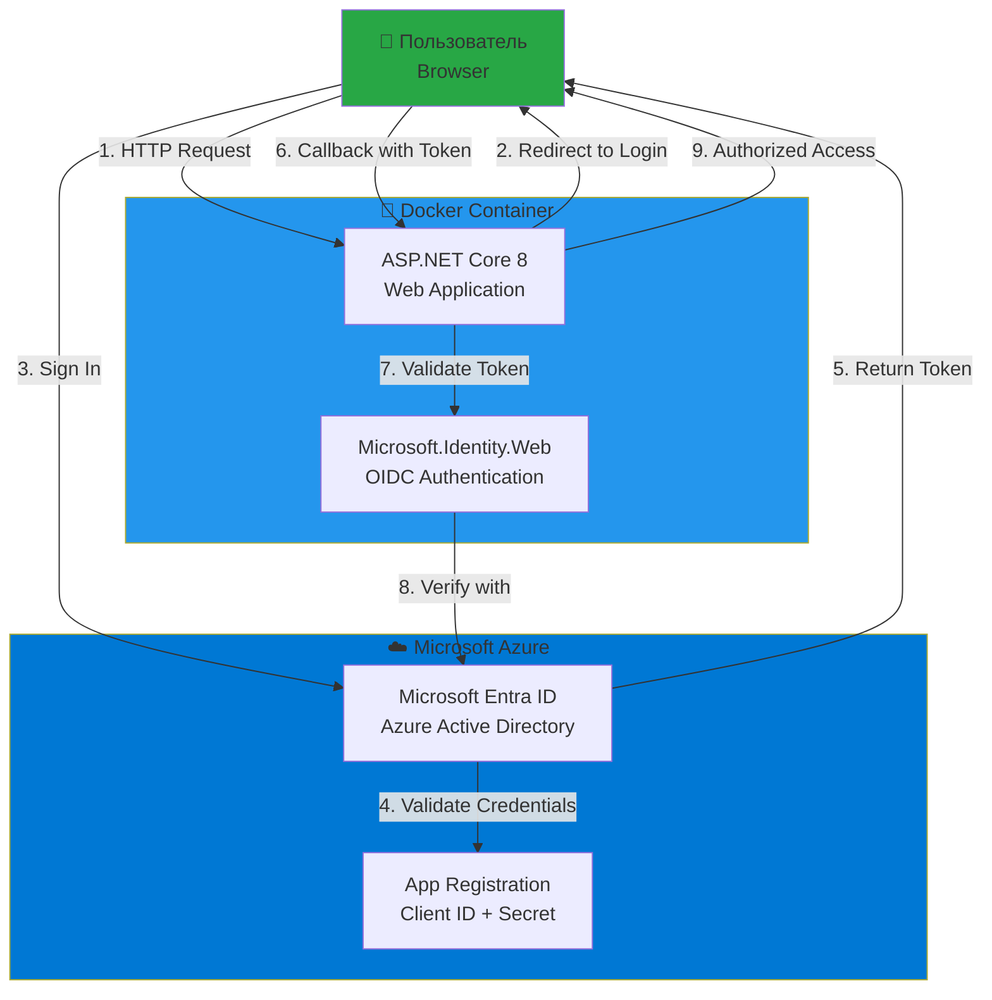
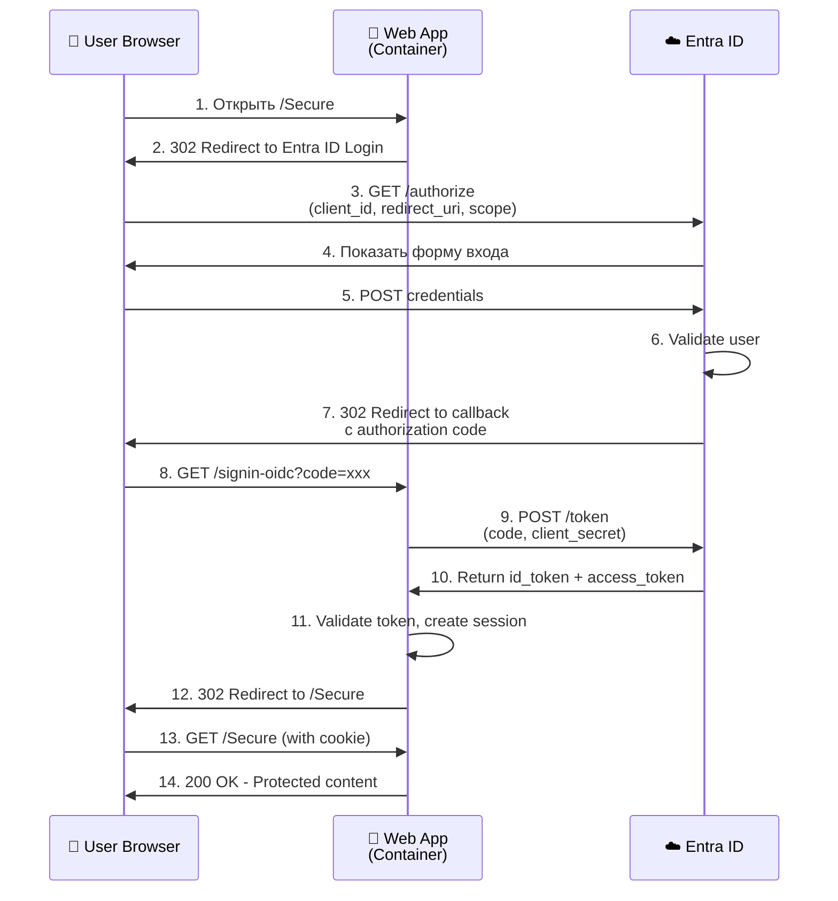
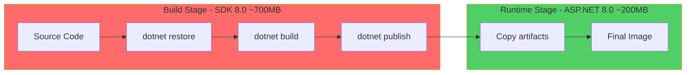
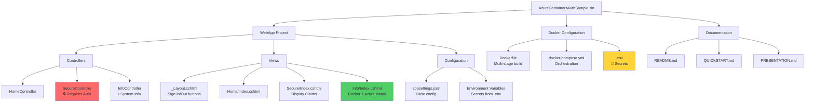
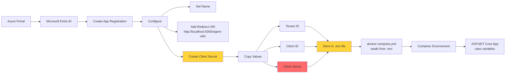

# Презентация: Docker & Azure Authentication

## 📊 Архитектурная диаграмма



## 🔄 Процесс аутентификации (OAuth 2.0 / OpenID Connect)



## 🐳 Docker Multi-Stage Build



## 📦 Компоненты проекта



## 🔐 Azure AD Configuration Flow



## 🎯 Демонстрационный сценарий

### 1️⃣ Подготовка (5 минут)

- Показать структуру проекта в VS
- Объяснить `Dockerfile` (multi-stage build)
- Показать `docker-compose.yml`
- Показать `.env.example`

### 2️⃣ Конфигурация Azure AD (5 минут)

- Открыть Azure Portal
- Создать App Registration
- Показать Redirect URI
- Создать Client Secret
- Скопировать значения в `.env`

### 3️⃣ Запуск Docker (3 минуты)

```powershell
# Показать команду
.\start-docker.ps1

# Или вручную
docker-compose up --build
```

- Показать процесс сборки образа
- Показать запуск контейнера
- Показать логи: `docker-compose logs -f`

### 4️⃣ Демонстрация работы (10 минут)

#### A. Главная страница
- Открыть http://localhost:5000
- Показать дизайн и описание проекта

#### B. Системная информация
- Перейти на `/Info`
- Показать:
  - ✓ Запущено в Docker
  - Hostname контейнера
  - Использование памяти
  - Azure AD конфигурация
  - .NET Runtime информация

#### C. Аутентификация
- Нажать "Войти через Entra ID"
- Показать редирект на login.microsoftonline.com
- Выполнить вход
- Показать имя пользователя в навигации

#### D. Защищенная зона
- Перейти в "Защищенная зона"
- Показать claims пользователя:
  - `name` - имя
  - `preferred_username` - email
  - `oid` - уникальный ID пользователя
  - `tid` - tenant ID
  - `roles` - роли (если настроены)

#### E. Выход
- Нажать "Выйти"
- Попытаться зайти в /Secure без авторизации
- Показать редирект на вход

### 5️⃣ Docker команды (5 минут)

```powershell
# Список контейнеров
docker ps

# Информация о контейнере
docker inspect azure-containers-auth-webapp

# Логи
docker logs azure-containers-auth-webapp

# Вход в контейнер
docker exec -it azure-containers-auth-webapp /bin/bash

# Проверка переменных окружения
docker exec azure-containers-auth-webapp printenv | Select-String Azure

# Статистика ресурсов
docker stats azure-containers-auth-webapp

# Остановка
docker-compose down
```

### 6️⃣ Код (опционально, 5 минут)

#### Program.cs
```csharp
// Показать конфигурацию аутентификации
builder.Services.AddAuthentication(OpenIdConnectDefaults.AuthenticationScheme)
	.AddMicrosoftIdentityWebApp(builder.Configuration.GetSection("AzureAd"));
```

#### SecureController.cs
```csharp
[Authorize]  // 🔒 Требует аутентификацию
public class SecureController : Controller
{
	public IActionResult Index()
	{
		var claims = User.Claims; // Получаем claims из токена
		return View(claims);
	}
}
```

#### Dockerfile
```dockerfile
# Multi-stage build для уменьшения размера образа
FROM mcr.microsoft.com/dotnet/sdk:8.0 AS build
# ... сборка ...

FROM mcr.microsoft.com/dotnet/aspnet:8.0 AS final
# ... только runtime, без SDK
```

## 📊 Сравнение подходов

| Характеристика | Локальный запуск | Docker | Azure App Service |
|----------------|------------------|--------|-------------------|
| Размер | ~2 GB (SDK) | ~200 MB (образ) | Управляется Azure |
| Портативность | Зависит от ОС | ✅ Любая ОС | ✅ Облако |
| Скорость старта | 5-10 сек | 3-5 сек | 30-60 сек |
| Изоляция | ❌ Нет | ✅ Да | ✅ Да |
| Масштабирование | ❌ Вручную | ⚠️ Оркестратор | ✅ Автоматически |
| Стоимость | $0 | $0 (локально) | От $13/месяц |

## 🎓 Образовательные цели

### Docker концепции
- ✅ Контейнеризация приложений
- ✅ Multi-stage builds
- ✅ Docker Compose для оркестрации
- ✅ Environment variables для конфигурации
- ✅ Healthchecks

### Azure концепции (AZ-900)
- ✅ Microsoft Entra ID (Azure AD)
- ✅ App Registration
- ✅ OAuth 2.0 / OpenID Connect
- ✅ Claims-based authentication
- ✅ Managed Identity (упоминание)
- ✅ Azure Container Registry
- ✅ Azure App Service для контейнеров

### .NET концепции
- ✅ ASP.NET Core 8
- ✅ Razor Pages / MVC
- ✅ Microsoft.Identity.Web
- ✅ Configuration management
- ✅ Middleware pipeline

## ❓ Вопросы для аудитории

1. **Почему multi-stage build лучше обычного?**
   - Ответ: Уменьшает размер образа (~700MB → ~200MB), убирает инструменты разработки из production

2. **Где хранить секреты в production?**
   - Ответ: Azure Key Vault, Environment Variables Azure App Service, Managed Identity

3. **Чем отличается authentication от authorization?**
   - Authentication: "Кто вы?" (проверка личности)
   - Authorization: "Что вам разрешено?" (проверка прав)

4. **Что такое claims?**
   - Ответ: Утверждения о пользователе в токене (имя, email, роли, и т.д.)

5. **Как масштабировать Docker-приложение?**
   - Локально: Docker Compose `--scale`
   - Production: Kubernetes, Azure Container Apps, Docker Swarm

## 📝 Домашнее задание

1. Добавить роли пользователей в Azure AD
2. Реализовать role-based authorization
3. Добавить Application Insights для мониторинга
4. Настроить CI/CD с GitHub Actions
5. Деплой в Azure Container Apps

## 🔗 Полезные ссылки

- [Docker Documentation](https://docs.docker.com/)
- [ASP.NET Core Security](https://docs.microsoft.com/aspnet/core/security/)
- [Microsoft Identity Platform](https://docs.microsoft.com/azure/active-directory/develop/)
- [Azure Container Services](https://azure.microsoft.com/services/container-instances/)
