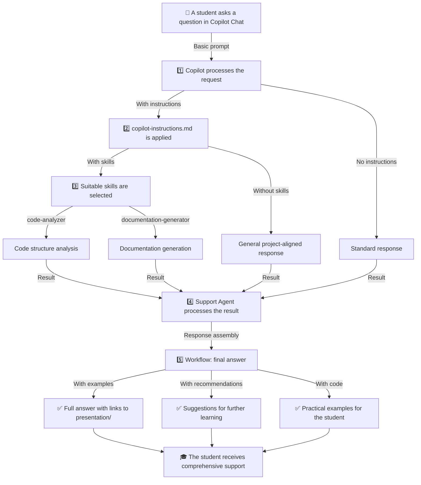

# Step 5: Workflow Diagram

## Visualization of the entire process



## Flow Description

### Stage 1: Basic Prompt (no extensions)
- A student writes a simple question in chat.
- Copilot gives a standard response.
- **Result**: basic information.

### Stage 2: Instructions (global rules)
- Rules from `copilot-instructions.md` are applied.
- Copilot reformats the response.
- It follows the required project style and constraints.
- **Result**: an answer that matches the project requirements.

### Stage 3: Skills (specialized tools)
- Appropriate skills are selected:
  - `code-analyzer` if the question is about code.
  - `documentation-generator` if documentation is needed.
- Skills perform specific tasks.
- **Result**: detailed analysis or structured documentation.

### Stage 4: Agent (high-level logic)
- `support-agent` coordinates the response.
- It selects the right skill.
- It adds project context.
- It recommends next steps.
- **Result**: a smart, contextual answer.

### Stage 5: Workflow (full chain)
- All components work together.
- The answer contains:
  - Core information
  - Examples from `presentation/`
  - Learning recommendations
  - Practical exercises
- **Result**: comprehensive help for the student.

## Key Transitions

| From | To | Activates | Result |
|---|---|---|---|
| Prompt | Instructions | Formatting rules | Consistent language and structure |
| Instructions | Skills | Specific context | Analysis or generation |
| Skills | Agent | Coordination | Intelligent processing |
| Agent | Workflow | Orchestration | Final response |

## Practical example

```
📝 A student asks:
"@support-agent Explain how Skills differ from Instructions?"

🔄 Workflow starts:
1. Prompt: basic request arrives
2. Instructions: rules apply (Russian, practical examples)
3. Skills: documentation-generator looks for information in presentation/
4. Agent: support-agent generates a response
5. Workflow: brings everything together into the final answer

✅ Result:
"Skills are specialized tools, Instructions are global rules.
Example: [code] Bymore details: [link to presentation/]"
```

## Summary of 5 steps

1. **Prompt** - input interface
2. **Instructions** - global logic
3. **Skills** - specialized capabilities
4. **Agent** - coordination and high-level logic
5. **Workflow** - integration of all levels into a single system