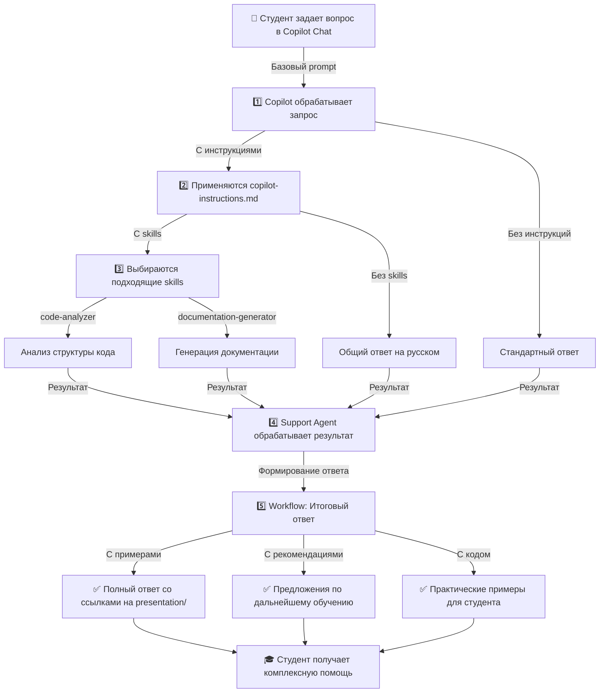

# Шаг 5: Workflow Diagram

## Визуализация всего процесса



## Описание потока

### Этап 1: Базовый Prompt (без расширений)
- Студент пишет простой вопрос в chat
- Copilot дает стандартный ответ
- **Результат**: базовая информация

### Этап 2: Instructions (глобальные правила)
- Применяются правила из `copilot-instructions.md`
- Copilot переформатирует ответ
- Гарантирует русский язык
- **Результат**: ответ, соответствующий требованиям проекта

### Этап 3: Skills (специализированные инструменты)
- Выбираются нужные skills:
  - `code-analyzer` — если вопрос о коде
  - `documentation-generator` — если нужна документация
- Skills выполняют специфические задачи
- **Результат**: детальный анализ или документация

### Этап 4: Agent (высокоуровневая логика)
- `support-agent` координирует ответ
- Выбирает правильный skill
- Добавляет контекст проекта
- Рекомендует дальнейшие шаги
- **Результат**: умный, контекстный ответ

### Этап 5: Workflow (полная цепочка)
- Все компоненты работают вместе
- Ответ содержит:
  - Основную информацию
  - Примеры из presentation/
  - Рекомендации по обучению
  - Практические упражнения
- **Результат**: комплексная помощь студенту

## Ключевые переходы

| От | К | Активирует | Результат |
|---|---|---|---|
| Prompt | Instructions | Правила форматирования | Русский язык, структура |
| Instructions | Skills | Специфический контекст | Анализ или генерация |
| Skills | Agent | Координация | Умная обработка |
| Agent | Workflow | Объединение | Финальный ответ |

## Практический пример

```
📝 Студент спрашивает:
"@support-agent Объясни, чем Skills отличаются от Instructions?"

🔄 Workflow запускается:
1. Prompt: базовый запрос поступает
2. Instructions: применяются правила (русский, практичные примеры)
3. Skills: documentation-generator ищет информацию в presentation/
4. Agent: support-agent формирует ответ
5. Workflow: объединяет все в финальный ответ

✅ Результат:
"Skills — это специализированные инструменты, Instructions — глобальные правила.
Пример: [код] Подробнее: [ссылка на presentation/]"
```

## Итоги 5 шагов

1. **Prompt** — входной интерфейс
2. **Instructions** — глобальная логика
3. **Skills** — специализированные возможности
4. **Agent** — координация и высокоуровневая логика
5. **Workflow** — интеграция всех уровней в единую систему
